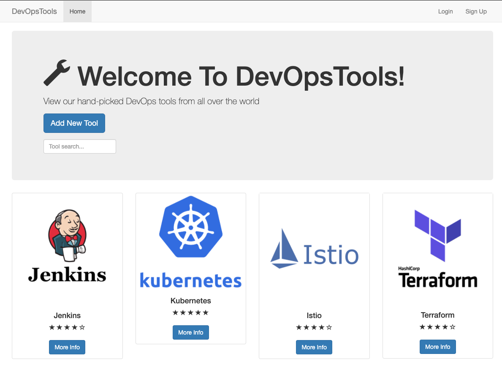

# Kubernetes Chaos experiments that test the availability, reliability and scalability of a basic two tier (Node.js and MongoDB) applicaion.

## Description
"It worked in UAT" is just one of the phrases no one wants to hear in production. This project will try to explore how Chaos Engineering can be implemented within multiple Kubernetes environments.

## A special mention to Viktor Farcic for his chaos course hosted on Udemy
[Udemy Course](https://www.udemy.com/course/kubernetes-chaos-engineering-with-chaos-toolkit-and-istio/) on kubernetes chaos engineering with chaos toolkit and istio

## Dependencies
To follow allow with the experiments within each section, you will need the following software installed:

- [Git](https://git-scm.com/)
- [kubectl](https://kubernetes.io/docs/tasks/tools/install-kubectl/)
- [Minikube](https://kubernetes.io/docs/tasks/tools/install-minikube/), [Kind](https://kind.sigs.k8s.io/docs/user/quick-start/) or [EKS](https://eksctl.io/)
- [Helm v3.x](https://helm.sh/docs/intro/install/)
- [Python v3.x](https://www.python.org/downloads)
- [pip](https://pip.pypa.io/en/stable/installing)

##  Chaos Toolkit
We will be using Chaos Toolkit to run our experiments, you can find out more information via the following links

- [Git Repo](https://github.com/chaostoolkit/chaostoolkit)
- [Website](https://chaostoolkit.org/)

### To Install the CLI

Install chaostoolkit as follows:
```
$ pip install chaostoolkit
```
You can verify the command was installed by running:

```
$ chaos --version
```

### Addon used
As we will be performing our experiments with Kubernetes, we need to install the chaostoolkit-kubernetes addon
- [chaostoolkit-kubernetes](https://github.com/chaostoolkit/chaostoolkit-kubernetes)

Install chaostoolkit-kubernetes add-on
```
pip install -U chaostoolkit-kubernetes
chaos discover chaostoolkit-kubernetes
```

you can also install the reporting add-on, but that requires a few extra dependencies
- [chaostoolkit-reporting (optional)](https://github.com/chaostoolkit/chaostoolkit-reporting)

## The Aplication we will be experimenting on
Our chaos experiments will be run against an application called "DevOpsTools", a Nodejs API that connects to a MongoDB backend and written just for this project (I am not a developer, so please do not judge me too harshly).

**NOTE: signing up, signing in and logging in is taking far too long, I will look into this, but it will not affect our experiments**



### Extra Info
- [DockerHub](https://hub.docker.com/repository/docker/gashers82/devops-tools-api)
- [GitHub](https://github.com/GlenAshwood/DevOpsTools-API)

## Minikube Experiments
- Experiment 1 - Basic application health check and app termination
- Experiment 2 - HTTP health check and app termination
- Experiment 3 - HTTP health check and DB termination

A walkthrough of these experiments can be found [Here](https://github.com/GlenAshwood/chaos-demo/tree/master/minikube)

## KIND Experiments
- Experiment 1 - Basic application health check and app termination
- Experiment 2 - HTTP health check and app termination
- Experiment 3 - HTTP health check and DB termination
- Experiment 4 - Draining a Worker Node
- Experiment 5 - Deleting a worker Node (or two)

A walkthrough of these experiments can be found [Here](https://github.com/GlenAshwood/chaos-demo/tree/master/kind)

## EKS Experiments
- Experiment 1 - Basic application health check and app termination
- Experiment 2 - HTTP health check and app termination
- Experiment 3 - HTTP health check and DB termination
- Experiment 4 - Draining a Worker Node
- Experiment 5 - Deleting a worker Node (or two)

A walkthrough of these experiments can be found [Here](https://github.com/GlenAshwood/chaos-demo/tree/master/eks)


