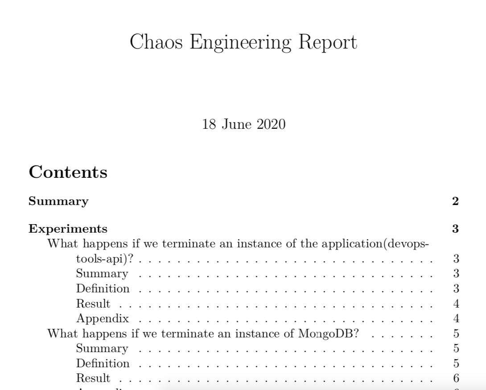

# EKS SETUP AND EXPERIMENTS

WARNING: Using an EKS cluster compared to kind or Minikube will cost you money with AWS, so please remember to destroy your cluster once you have finished testing with it.

## Dependencies
- [Git](https://git-scm.com/)
- [kubectl](https://kubernetes.io/docs/tasks/tools/install-kubectl/)
- [aws cli](https://docs.aws.amazon.com/cli/latest/userguide/cli-chap-install.html)
- [etsctl](https://eksctl.io/)
- [Helm v3.x](https://helm.sh/docs/intro/install/)
- [Python v3.x](https://www.python.org/downloads)
- [pip](https://pip.pypa.io/en/stable/installing)
- [istioctl](https://istio.io/latest/docs/setup/install/)

## Aplication
The application being tested is called DevOpsTools-API, a Node.js API that connects to a Mongo Database. Both components will be deployed within our cluster.
- [DockerHub](https://hub.docker.com/repository/docker/gashers82/devops-tools-api)
- [GitHub](https://github.com/GlenAshwood/DevOpsTools-API)

### Original Deployments
3 devops-tools-api pods
1 MongoDB pod

### Clone Repo

To follow along, please clone the **chaos-demo** repo and cd to **eks**
```
git clone https://github.com/GlenAshwood/chaos-demo.git
cd eks
```

## Setup EKS Cluster

We will be using a cluster with three worker nodes for the following experiments

### Create EKS Cluster

The following instructions will assume you have the following setup:
- An account with AWS
- Credentials with adequate permissions to create, update destroy an EKS cluster within AWS
- Installed and configured the AWS CLI to use those credenticals

set Default Region (example)
```
export AWS_DEFAULT_REGION=us-west-2
```

```
eksctl create cluster \
 --name chaos \
 --region $AWS_DEFAULT_REGION \
 --node-type t2.large \
 --nodes-max 6 \
 --nodes-min 3 \
 --asg-access \
 --managed
```
Enable the *NGINX Ingress controller*:
```
kubectl create ns ingress-nginx

helm repo add nginx-stable https://helm.nginx.com/stable
helm install nginx-controller -n ingress-nginx \
 nginx-stable/nginx-ingress \
 --set controller.replicaCount=3
```
Enable *metrics-server* :
```
kubectl apply -f https://github.com/kubernetes-sigs/metrics-server/releases/download/v0.3.6/components.yaml
```
Export Localhost/loopback ip to $INGRESS_HOST (which will be used later):
```
export INGRESS_HOST=$(kubectl \
 --namespace ingress-nginx \
 get service nginx-controller-nginx-ingress \
 --output jsonpath="{.status.loadBalancer.ingress[0].hostname}")
```
Update host file for devops-tools.io IP (optional)
```
nslookup $INGRESS_HOST
sudo vi /etc/hosts
---
add entry for *EXTERNAL-IP*  devops-tools.io
```

## Install Service Mesh
TBC

## Install Application
Create **chaos-space** namespace and enable istio-injection (incase we use it later)
```
kubectl create namespace chaos-space
kubectl label namespace chaos-space istio-injection=enabled
```
Change context to **chaos-space**namespace
```
kubectl config set-context --current --namespace=chaos-space
```

Deploy API and Mongo into **chaos-space** namespace
```
helm repo add bitnami https://charts.bitnami.com/bitnami
helm install devops-tools -f mongo-values.yaml\
  bitnami/mongodb
  
kubectl apply -f api-setup.yaml
```
Check Application in webbrowser: 
```
open http://devops-tools.io
```

## Terminating PODs within our Cluster

### Experiment 1 - Basic application health check and app termination
This experiment will verify that all pods are running within the choosen namespace (in our case **chaos-space**), if "healthy", a random pod with our choosen label (**app=devops-tools-api**) will be terminatated. Once that action has been completed, the namespace will be probed again to confirm pods are running

```
chaos run chaos/health-test-1.yaml
```
expected output:
``` bash
[2020-06-20 23:32:12 INFO] Validating the experiment's syntax
[2020-06-20 23:32:13 INFO] Experiment looks valid
[2020-06-20 23:32:13 INFO] Running experiment: What happens if we terminate a Pod?
[2020-06-20 23:32:13 INFO] Steady state hypothesis: Pod exists
[2020-06-20 23:32:13 INFO] Probe: pod-exists
[2020-06-20 23:32:13 INFO] Probe: pod-in-phase
[2020-06-20 23:32:14 INFO] Probe: pod-in-conditions
[2020-06-20 23:32:14 INFO] Steady state hypothesis is met!
[2020-06-20 23:32:14 INFO] Action: terminate-pod
[2020-06-20 23:32:14 INFO] Pausing after activity for 15s...
[2020-06-20 23:32:29 INFO] Steady state hypothesis: Pod exists
[2020-06-20 23:32:29 INFO] Probe: pod-exists
[2020-06-20 23:32:29 INFO] Probe: pod-in-phase
[2020-06-20 23:32:30 INFO] Probe: pod-in-conditions
[2020-06-20 23:32:30 INFO] Steady state hypothesis is met!
[2020-06-20 23:32:30 INFO] Let's rollback...
[2020-06-20 23:32:30 INFO] No declared rollbacks, let's move on.
[2020-06-20 23:32:30 INFO] Experiment ended with status: completed
```
The experiment passed, but it really doesnt tell us anything that useful besides the pods within that namespace are running before and after the experiment.

### Experiment 2 - HTTP health check and app termination

This time, instead of just verifying thats pods are running before and after the experiment, we will check the availability of the application by validating that **http://${ingress_host}/tools** is reachable before and again after we terminate a random instance's of the devops-tools-api app. 

```
chaos run chaos/health-test-2.yaml
```
expected output:
``` bash
[2020-06-20 23:35:40 INFO] Validating the experiment's syntax
[2020-06-20 23:35:41 INFO] Experiment looks valid
[2020-06-20 23:35:41 INFO] Running experiment: What happens if we terminate an instance of the application(devops-tools-api)?
[2020-06-20 23:35:41 INFO] Steady state hypothesis: The application is healthy
[2020-06-20 23:35:41 INFO] Probe: app-responds-to-requests
[2020-06-20 23:35:42 INFO] Steady state hypothesis is met!
[2020-06-20 23:35:42 INFO] Action: terminate-app-pod
[2020-06-20 23:35:43 INFO] Pausing after activity for 2s...
[2020-06-20 23:35:45 INFO] Steady state hypothesis: The application is healthy
[2020-06-20 23:35:45 INFO] Probe: app-responds-to-requests
[2020-06-20 23:35:45 INFO] Steady state hypothesis is met!
[2020-06-20 23:35:45 INFO] Let's rollback...
[2020-06-20 23:35:45 INFO] No declared rollbacks, let's move on.
[2020-06-20 23:35:45 INFO] Experiment ended with status: completed
```
Again, the experiment passed, which gives us a little bit more confidence in our application's ability to recover from a slight outage, but what happens if the same thing happens to the DB instance?

### Experiment 3 - HTTP health check and DB termination

For the third experiment, we will do the same HTTP validations we did during the second experiment, but this time we will terminate an instance of MongoDB. As we only have 1 instance of the DB running, we can assume the outcome of this experiment, but lets run it anyway:

```
chaos run chaos/health-test-3.yaml
```
expected output:
``` bash
[2020-06-20 23:36:57 INFO] Validating the experiment's syntax
[2020-06-20 23:36:58 INFO] Experiment looks valid
[2020-06-20 23:36:58 INFO] Running experiment: What happens if we terminate an instance of the MongoDB?
[2020-06-20 23:36:58 INFO] Steady state hypothesis: The application is healthy
[2020-06-20 23:36:58 INFO] Probe: app-responds-to-requests
[2020-06-20 23:36:58 INFO] Steady state hypothesis is met!
[2020-06-20 23:36:58 INFO] Action: terminate-db-pod
[2020-06-20 23:36:58 INFO] Pausing after activity for 4s...
[2020-06-20 23:37:02 INFO] Steady state hypothesis: The application is healthy
[2020-06-20 23:37:02 INFO] Probe: app-responds-to-requests
[2020-06-20 23:37:06 ERROR]   => failed: activity took too long to complete
[2020-06-20 23:37:06 WARNING] Probe terminated unexpectedly, so its tolerance could not be validated
[2020-06-20 23:37:06 CRITICAL] Steady state probe 'app-responds-to-requests' is not in the given tolerance so failing this experiment
[2020-06-20 23:37:06 INFO] Let's rollback...
[2020-06-20 23:37:06 INFO] No declared rollbacks, let's move on.
[2020-06-20 23:37:06 INFO] Experiment ended with status: deviated
[2020-06-20 23:37:06 INFO] The steady-state has deviated, a weakness may have been discovered
```
As expected (hopefully), the experiment failed. The DB tier does recover, but not quickily enough and we have downtime. so lets try and fix that now by enabling ReplicaSet on our devops-tools chart.

First we need to update our helm chart to enable replication 
```
helm upgrade devops-tools -f mongo-values-rs.yaml\
  bitnami/mongodb
```
Once complete, we now have multiple instance of our DB
```
statefulset.apps/devopstools-release-mongodb-arbiter     1/1     115s
statefulset.apps/devopstools-release-mongodb-primary     1/1     115s
statefulset.apps/devopstools-release-mongodb-secondary   1/1     115s
```
We also need to update our application to use the new connection string. I found the easiest way to do this was by deleting and re-adding the configuration
```
kubectl delete -f api-setup.yaml
kubectl apply -f api-setup-db-rs.yaml
```
So, lets try experiment 3 again.

```
chaos run chaos/health-test-3.yaml
```
expected output:
```
[2020-06-20 23:52:26 INFO] Validating the experiment's syntax
[2020-06-20 23:52:27 INFO] Experiment looks valid
[2020-06-20 23:52:27 INFO] Running experiment: What happens if we terminate an instance of the MongoDB?
[2020-06-20 23:52:27 INFO] Steady state hypothesis: The application is healthy
[2020-06-20 23:52:27 INFO] Probe: app-responds-to-requests
[2020-06-20 23:52:28 INFO] Steady state hypothesis is met!
[2020-06-20 23:52:28 INFO] Action: terminate-db-pod
[2020-06-20 23:52:28 INFO] Pausing after activity for 4s...
[2020-06-20 23:52:32 INFO] Steady state hypothesis: The application is healthy
[2020-06-20 23:52:32 INFO] Probe: app-responds-to-requests
[2020-06-20 23:52:32 INFO] Steady state hypothesis is met!
[2020-06-20 23:52:32 INFO] Let's rollback...
[2020-06-20 23:52:32 INFO] No declared rollbacks, let's move on.
[2020-06-20 23:52:32 INFO] Experiment ended with status: completed
```
The experiment passed, but I wanted to confirm that the results were consistant across all three instances of the DB. It wasnt, as the experiment would fail if the primary was the instance terminated. 

```
$chaos run chaos/health-test-3.yaml 

[2020-06-20 23:56:10 INFO] Validating the experiment's syntax
[2020-06-20 23:56:10 INFO] Experiment looks valid
[2020-06-20 23:56:10 INFO] Running experiment: What happens if we terminate an instance of the MongoDB?
[2020-06-20 23:56:10 INFO] Steady state hypothesis: The application is healthy
[2020-06-20 23:56:10 INFO] Probe: app-responds-to-requests
[2020-06-20 23:56:10 INFO] Steady state hypothesis is met!
[2020-06-20 23:56:10 INFO] Action: terminate-db-pod
[2020-06-20 23:56:11 INFO] Pausing after activity for 4s...
[2020-06-20 23:56:15 INFO] Steady state hypothesis: The application is healthy
[2020-06-20 23:56:15 INFO] Probe: app-responds-to-requests
[2020-06-20 23:56:18 ERROR]   => failed: activity took too long to complete
[2020-06-20 23:56:18 WARNING] Probe terminated unexpectedly, so its tolerance could not be validated
[2020-06-20 23:56:18 CRITICAL] Steady state probe 'app-responds-to-requests' is not in the given tolerance so failing this experiment
[2020-06-20 23:56:18 INFO] Let's rollback...
[2020-06-20 23:56:18 INFO] No declared rollbacks, let's move on.
[2020-06-20 23:56:18 INFO] Experiment ended with status: deviated
[2020-06-20 23:56:18 INFO] The steady-state has deviated, a weakness may have been discovered

$kubectl get pod

NAME                                   READY   STATUS              RESTARTS   AGE
pod/devops-tools-api-f96d765df-9zvhv   1/1     Running             0          60m
pod/devops-tools-api-f96d765df-xmwpl   1/1     Running             0          60m
pod/devops-tools-mongodb-arbiter-0     1/1     Running             0          64m
pod/devops-tools-mongodb-primary-0     0/1     ContainerCreating   0          8s
pod/devops-tools-mongodb-secondary-0   1/1     Running             0          64m
```
As I wasnt seeing the outage as the user (apart from a slower response), I decided to try increasing my pause timers until the primary passed the test. Obviously in the real world, you wouldnt do this, you would tune your application and database!

So at 11 seconds (5.5 times slower than we originally wanted), our DB setup passes our experiment when the primary is terminated. 

```
chaos run chaos/health-test-4.yaml
```
Output
```
[2020-06-20 23:57:25 INFO] Validating the experiment's syntax
[2020-06-20 23:57:25 INFO] Experiment looks valid
[2020-06-20 23:57:25 INFO] Running experiment: What happens if we terminate an instance of MongoDB?
[2020-06-20 23:57:25 INFO] Steady state hypothesis: The application is healthy
[2020-06-20 23:57:25 INFO] Probe: app-responds-to-requests
[2020-06-20 23:57:26 INFO] Steady state hypothesis is met!
[2020-06-20 23:57:26 INFO] Action: terminate-db-pod
[2020-06-20 23:57:26 INFO] Pausing after activity for 11s...
[2020-06-20 23:57:37 INFO] Steady state hypothesis: The application is healthy
[2020-06-20 23:57:37 INFO] Probe: app-responds-to-requests
[2020-06-20 23:57:38 INFO] Steady state hypothesis is met!
[2020-06-20 23:57:38 INFO] Let's rollback...
[2020-06-20 23:57:38 INFO] No declared rollbacks, let's move on.
[2020-06-20 23:57:38 INFO] Experiment ended with status: completed

$ kubectl get pods

NAME                                   READY   STATUS    RESTARTS   AGE
pod/devops-tools-api-f96d765df-9zvhv   1/1     Running   0          78m
pod/devops-tools-api-f96d765df-xmwpl   1/1     Running   0          78m
pod/devops-tools-mongodb-arbiter-0     1/1     Running   0          8m31s
pod/devops-tools-mongodb-primary-0     0/1     Running   0          11s
pod/devops-tools-mongodb-secondary-0   1/1     Running   0          81s
```

Although recovery wasnt seamless, we can now confidently say that our deployment will recovery from accidential pod terminations for both the API and the DB.

## Draining and Deleting Worker Nodes

### Experiment 4 - Draining a Worker Node

This expierment verifies what happens to our application when a node is drained, replicating what could happen for a cluster upgrade or a scheduled maintenance window.

For this experiment, we need to make sure that we have deployed three instances of our application (**api-setup-db-rs.yaml**) and that we have enabled ReplicateSets for our DB (**mongo-values-rs.yam**):

```
helm install devops-tools -f mongo-values-rs.yaml \
  bitnami/mongodb
  
kubectl apply -f api-setup-db-rs.yaml
```
Output:

kubectl get pods -o wide
```
NAME                                READY   STATUS    RESTARTS   AGE     IP               NODE                                           NOMINATED NODE   READINESS GATES
devops-tools-api-8545cfc559-hjj4n   1/1     Running   0          7m49s   192.168.16.90    ip-192-168-10-101.eu-west-1.compute.internal   <none>           <none>
devops-tools-api-8545cfc559-n5t2v   1/1     Running   0          7m49s   192.168.88.56    ip-192-168-89-65.eu-west-1.compute.internal    <none>           <none>
devops-tools-api-8545cfc559-n8sg8   1/1     Running   0          7m50s   192.168.46.185   ip-192-168-48-55.eu-west-1.compute.internal    <none>           <none>
devops-tools-mongodb-arbiter-0      1/1     Running   0          111s    192.168.33.72    ip-192-168-48-55.eu-west-1.compute.internal    <none>           <none>
devops-tools-mongodb-primary-0      0/1     Running   0          5s      192.168.86.152   ip-192-168-89-65.eu-west-1.compute.internal    <none>           <none>
devops-tools-mongodb-secondary-0    1/1     Running   0          2m55s   192.168.88.7     ip-192-168-89-65.eu-west-1.compute.internal    <none>           <none>
```
By adding the **-o wide** flag to our get pods command, we can see which nodes our application and DB instances have been deployed to

Now we have made sure our application is setup the way we require, we can run our next expierment.

To run the test, use the following command:
```
chaos run chaos/node-drain.yaml
```
Output
```
[2020-06-20 16:02:34 INFO] Validating the experiment's syntax
[2020-06-20 16:02:36 INFO] Experiment looks valid
[2020-06-20 16:02:36 INFO] Running experiment: What happens if we drain a node
[2020-06-20 16:02:36 INFO] Steady state hypothesis: Applications are indestructible
[2020-06-20 16:02:36 INFO] Probe: app-responds-to-requests
[2020-06-20 16:02:36 INFO] Steady state hypothesis is met!
[2020-06-20 16:02:36 INFO] Action: drain-node
[2020-06-20 16:02:37 ERROR]   => failed: chaoslib.exceptions.ActivityFailed: Failed to evict pod devops-tools-mongodb-secondary-0: {"kind":"Status","apiVersion":"v1","metadata":{},"status":"Failure","message":"Cannot evict pod as it would violate the pod's disruption budget.","reason":"TooManyRequests","details":{"causes":[{"reason":"DisruptionBudget","message":"The disruption budget devops-tools-mongodb-secondary needs 1 healthy pods and has 1 currently"}]},"code":429}
[2020-06-20 16:02:37 INFO] Pausing after activity for 1s...
[2020-06-20 16:02:38 INFO] Steady state hypothesis: Applications are indestructible
[2020-06-20 16:02:38 INFO] Probe: app-responds-to-requests
[2020-06-20 16:02:38 INFO] Steady state hypothesis is met!
[2020-06-20 16:02:38 INFO] Let's rollback...
[2020-06-20 16:02:38 INFO] Rollback: uncordon-node
[2020-06-20 16:02:38 INFO] Action: uncordon-node
[2020-06-20 16:02:38 INFO] Experiment ended with status: completed
```
However, we run into an issue and the experiment fails due to the disruption budget for Mongo DB.

Lets try scaling both arbiter and secondary to 2 instances

```
helm upgrade devops-tools -f mongo-values-rs-scaled.yaml\
  bitnami/mongodb
```
kubectl get pods
```
NAME                                READY   STATUS    RESTARTS   AGE
devops-tools-api-8545cfc559-hjj4n   1/1     Running   0          12m
devops-tools-api-8545cfc559-n5t2v   1/1     Running   0          12m
devops-tools-api-8545cfc559-n94st   1/1     Running   0          3m8s
devops-tools-mongodb-arbiter-0      1/1     Running   1          6m8s
devops-tools-mongodb-arbiter-1      1/1     Running   0          2m33s
devops-tools-mongodb-primary-0      1/1     Running   0          4m22s
devops-tools-mongodb-secondary-0    1/1     Running   0          7m12s
devops-tools-mongodb-secondary-1    1/1     Running   0          2m33s
```
Lets try our same experiment again
```
chaos run chaos/node-drain.yaml
```
Output
```
[2020-06-21 00:05:43 INFO] Validating the experiment's syntax
[2020-06-21 00:05:44 INFO] Experiment looks valid
[2020-06-21 00:05:44 INFO] Running experiment: What happens if we drain a node
[2020-06-21 00:05:44 INFO] Steady state hypothesis: Applications are indestructible
[2020-06-21 00:05:44 INFO] Probe: app-responds-to-requests
[2020-06-21 00:05:45 INFO] Steady state hypothesis is met!
[2020-06-21 00:05:45 INFO] Action: drain-node
[2020-06-21 00:06:27 INFO] Pausing after activity for 1s...
[2020-06-21 00:06:28 INFO] Steady state hypothesis: Applications are indestructible
[2020-06-21 00:06:28 INFO] Probe: app-responds-to-requests
[2020-06-21 00:06:28 INFO] Steady state hypothesis is met!
[2020-06-21 00:06:28 INFO] Let's rollback...
[2020-06-21 00:06:28 INFO] Rollback: uncordon-node
[2020-06-21 00:06:28 INFO] Action: uncordon-node
[2020-06-21 00:06:29 INFO] Experiment ended with status: completed
```
And our experiment now runs succuesslly and we are confident that our application is robust enough to recover from a node within the cluster being drained and uncordon again

### Experiment 5 - Deleting a Worker Node (or two)

We will now finally verify what happens to our application when we delete a node within the cluster, trying to replicate a possible platform outage or misconfiguration.

Add a label to each worker node 
```
kubectl label nodes delete-ready=true
```
We will be keeping the same configuration that sucesscfully passed the last expierment, so please make sure you are using the scaled DB setup to start this expierment:

New:
```
helm install devops-tools -f mongo-values-rs-scaled.yaml \
  bitnami/mongodb

kubectl apply -f api-setup-db-rs.yaml
```
Upgrade:
```
helm upgrade devops-tools -f mongo-values-rs-scaled.yaml \
  bitnami/mongodb

kubectl apply -f api-setup-db-rs.yaml
```
Output
```
kubectl get pod
NAME                                READY   STATUS    RESTARTS   AGE
devops-tools-api-5d7c4f7499-csjp6   1/1     Running   0          7m50s
devops-tools-api-5d7c4f7499-m8ww4   1/1     Running   0          36m
devops-tools-api-5d7c4f7499-r648h   1/1     Running   0          13m
devops-tools-mongodb-arbiter-0      1/1     Running   3          13m
devops-tools-mongodb-arbiter-1      1/1     Running   4          16m
devops-tools-mongodb-primary-0      1/1     Running   0          36m
devops-tools-mongodb-secondary-0    1/1     Running   0          49m
devops-tools-mongodb-secondary-1    1/1     Running   0          7m47s
```
To run the experiment
```
chaos run chaos/node-delete.yaml 
```
Output
```
[2020-06-21 00:14:17 INFO] Validating the experiment's syntax
[2020-06-21 00:14:18 INFO] Experiment looks valid
[2020-06-21 00:14:18 INFO] Running experiment: What happens if we delete a node
[2020-06-21 00:14:18 INFO] Steady state hypothesis: Applications are indestructible
[2020-06-21 00:14:18 INFO] Probe: app-responds-to-requests
[2020-06-21 00:14:18 INFO] Steady state hypothesis is met!
[2020-06-21 00:14:18 INFO] Action: delete-node
[2020-06-21 00:14:19 INFO] Pausing after activity for 10s...
[2020-06-21 00:14:29 INFO] Steady state hypothesis: Applications are indestructible
[2020-06-21 00:14:29 INFO] Probe: app-responds-to-requests
[2020-06-21 00:14:29 INFO] Steady state hypothesis is met!
[2020-06-21 00:14:29 INFO] Let's rollback...
[2020-06-21 00:14:29 INFO] No declared rollbacks, let's move on.
[2020-06-21 00:14:29 INFO] Experiment ended with status: completed

kubectl get nodes

NAME                                           STATUS   ROLES    AGE    VERSION
ip-192-168-10-101.eu-west-1.compute.internal   Ready    <none>   136m   v1.16.8-eks-e16311
ip-192-168-89-65.eu-west-1.compute.internal    Ready    <none>   136m   v1.16.8-eks-e16311

```
Happy days (unless your name was ip-192-168-48-55.eu-west-1), our application continuted to function even after we lost a node within our cluster. If we were feeling really brave, I guess we could run the expierment ONE MORE TIME:

```
$ chaos run chaos/node-delete.yaml 

[2020-06-21 00:16:46 INFO] Validating the experiment's syntax
[2020-06-21 00:16:47 INFO] Experiment looks valid
[2020-06-21 00:16:47 INFO] Running experiment: What happens if we delete a node
[2020-06-21 00:16:47 INFO] Steady state hypothesis: Applications are indestructible
[2020-06-21 00:16:47 INFO] Probe: app-responds-to-requests
[2020-06-21 00:16:48 INFO] Steady state hypothesis is met!
[2020-06-21 00:16:48 INFO] Action: delete-node
[2020-06-21 00:16:49 INFO] Pausing after activity for 10s...
[2020-06-21 00:16:59 INFO] Steady state hypothesis: Applications are indestructible
[2020-06-21 00:16:59 INFO] Probe: app-responds-to-requests
[2020-06-21 00:16:59 INFO] Steady state hypothesis is met!
[2020-06-21 00:16:59 INFO] Let's rollback...
[2020-06-21 00:16:59 INFO] No declared rollbacks, let's move on.
[2020-06-21 00:16:59 INFO] Experiment ended with status: completed

kubectl get nodes

NAME                                           STATUS   ROLES    AGE    VERSION
ip-192-168-10-101.eu-west-1.compute.internal   Ready    <none>   139m   v1.16.8-eks-e16311
```

Even better, we now know we can actually lost two nodes within our cluster and our application will still successfully pass our our steadystate probe.

## Reporting

You can also report on your experiments by adding the **--journal-path** flag to your chaos run command

```
chaos run chaos/health-test-2.yaml \
  --journal-path journal-health-http-api.json

[2020-06-18 15:40:02 INFO] Validating the experiment's syntax
[2020-06-18 15:40:04 INFO] Experiment looks valid
[2020-06-18 15:40:04 INFO] Running experiment: What happens if we terminate an instance of the application(devops-tools-api)?
[2020-06-18 15:40:04 INFO] Steady state hypothesis: The application is healthy
[2020-06-18 15:40:04 INFO] Probe: app-responds-to-requests
[2020-06-18 15:40:04 INFO] Steady state hypothesis is met!
[2020-06-18 15:40:04 INFO] Action: terminate-app-pod
[2020-06-18 15:40:04 INFO] Pausing after activity for 2s...
[2020-06-18 15:40:06 INFO] Steady state hypothesis: The application is healthy
[2020-06-18 15:40:06 INFO] Probe: app-responds-to-requests
[2020-06-18 15:40:06 INFO] Steady state hypothesis is met!
[2020-06-18 15:40:06 INFO] Let's rollback...
[2020-06-18 15:40:06 INFO] No declared rollbacks, let's move on.
[2020-06-18 15:40:06 INFO] Experiment ended with status: completed
```
```
chaos run chaos/health-test-4.yaml \
  --journal-path journal-health-http-db.json
  
[2020-06-18 15:46:31 INFO] Validating the experiment's syntax
[2020-06-18 15:46:32 INFO] Experiment looks valid
[2020-06-18 15:46:32 INFO] Running experiment: What happens if we terminate an instance of MongoDB?
[2020-06-18 15:46:32 INFO] Steady state hypothesis: The application is healthy
[2020-06-18 15:46:32 INFO] Probe: app-responds-to-requests
[2020-06-18 15:46:32 INFO] Steady state hypothesis is met!
[2020-06-18 15:46:32 INFO] Action: terminate-db-pod
[2020-06-18 15:46:32 INFO] Pausing after activity for 11s...
[2020-06-18 15:46:43 INFO] Steady state hypothesis: The application is healthy
[2020-06-18 15:46:43 INFO] Probe: app-responds-to-requests
[2020-06-18 15:46:44 INFO] Steady state hypothesis is met!
[2020-06-18 15:46:44 INFO] Let's rollback...
[2020-06-18 15:46:44 INFO] No declared rollbacks, let's move on.
[2020-06-18 15:46:44 INFO] Experiment ended with status: completed
```
You can install the reporting addon for Chaos Toolkit or you can run the command within Docker, like we will here.

Run the following docker command to report on the above experiments:
```
docker container run --user $(id -u) --volume $PWD:/tmp/result \
-it chaostoolkit/reporting -- report --export-format=pdf \
journal-health-http-api.json  journal-health-http-db.json \
report.pdf
```
output
```
Report generated as 'report.pdf'
```
Once complete, you will have generated a pdf version of report like the example below:



## Destroy Application
Once complete, please remember to delete deployments and revert back to the **default** namespace
```
kubectl delete -f api-setup.yaml
helm uninstall devopstools-release
kubectl config set-context --current --namespace=default
```
or 
```
kubectl delete ns chaos-space
kubectl config set-context --current --namespace=default
```

## Destroy Cluster
To delete your cluster, run the following command
```
eksctl delete cluster \
 --name chaos \
 --region $AWS_DEFAULT_REGION 
```
