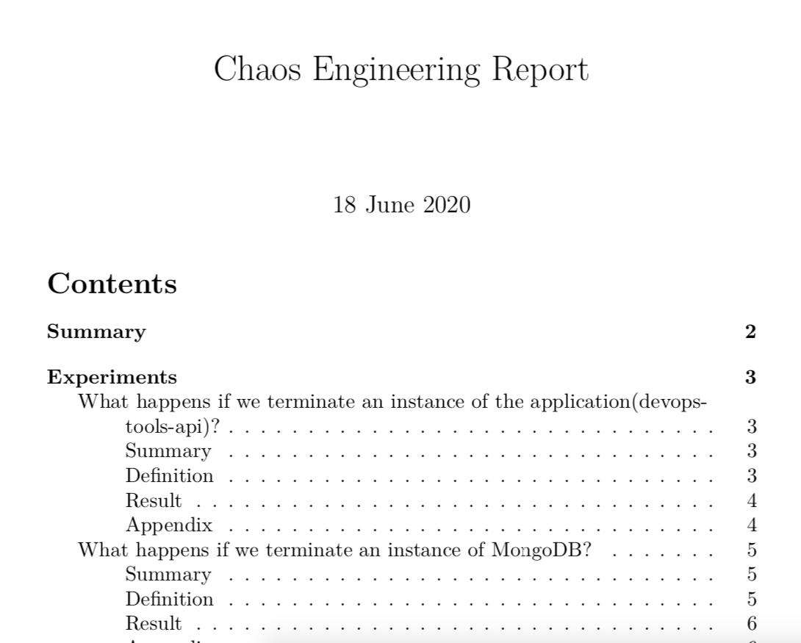

# MINIKUBE SETUP AND EXPERIMENTS

## Dependencies
- [Git](https://git-scm.com/)
- [kubectl](https://kubernetes.io/docs/tasks/tools/install-kubectl/)
- [Minikube](https://kubernetes.io/docs/tasks/tools/install-minikube/)
- [Helm v3.x](https://helm.sh/docs/intro/install/)
- [Python v3.x](https://www.python.org/downloads)
- [pip](https://pip.pypa.io/en/stable/installing)
- [istioctl](https://istio.io/latest/docs/setup/install/)

## Aplication
The application being tested is called DevOpsTools-API, a Node.js API that connects to a Mongo Database. Both components will be deployed within our cluster.
- [DockerHub](https://hub.docker.com/repository/docker/gashers82/devops-tools-api)
- [GitHub](https://github.com/GlenAshwood/DevOpsTools-API)

### Original Deployments
2 devops-tools-api pods
1 MongoDB pod

### Clone Repo

To follow along, please clone the **chaos-demo** repo and cd to **minikube**
```
git clone https://github.com/GlenAshwood/chaos-demo.git
cd minikube
```

## Setup Minikube Cluster 

Create or restart Minikube Cluster
```
minikube start
```
Enable the *NGINX Ingress controller* addon:
```
minikube addons enable ingress
```
Enable *metrics-server* addon:
```
minikube addons enable metrics-server
```
Export Minikube ip to $INGRESS_HOST (which will be used later):
```
export INGRESS_HOST=$(minikube ip)
```

## Install Service Mesh
TBC

## Install Application
Create **chaos-space** namespace and enable istio-injection (incase we use it later)
```
kubectl create namespace chaos-space
kubectl label namespace chaos-space istio-injection=enabled
```
Change context to **chaos-space**namespace
```
kubectl config set-context --current --namespace=chaos-space
```

Deploy API and Mongo into **chaos-space** namespace
```
helm repo add bitnami https://charts.bitnami.com/bitnami
helm install devops-tools -f mongo-values.yaml\
  bitnami/mongodb
  
kubectl apply -f api-setup.yaml
```
To check current Minikube IP
```
minikube ip
```
To open Application in default browser: 
```
minikube service devops-tools-api-service  -n chaos-space
```

## Terminating PODs within our Cluster

### Experiment 1 - Basic application health check and app termination
This experiment will verify that all pods are running within the choosen namespace (in our case **chaos-space**), if "healthy", a random pod with our choosen label (**app=devops-tools-api**) will be terminatated. Once that action has been completed, the namespace will be probed again to confirm pods are running

```
chaos run chaos/health-test-1.yaml
```
expected output:
``` bash
[2020-06-20 23:32:12 INFO] Validating the experiment's syntax
[2020-06-20 23:32:13 INFO] Experiment looks valid
[2020-06-20 23:32:13 INFO] Running experiment: What happens if we terminate a Pod?
[2020-06-20 23:32:13 INFO] Steady state hypothesis: Pod exists
[2020-06-20 23:32:13 INFO] Probe: pod-exists
[2020-06-20 23:32:13 INFO] Probe: pod-in-phase
[2020-06-20 23:32:14 INFO] Probe: pod-in-conditions
[2020-06-20 23:32:14 INFO] Steady state hypothesis is met!
[2020-06-20 23:32:14 INFO] Action: terminate-pod
[2020-06-20 23:32:14 INFO] Pausing after activity for 15s...
[2020-06-20 23:32:29 INFO] Steady state hypothesis: Pod exists
[2020-06-20 23:32:29 INFO] Probe: pod-exists
[2020-06-20 23:32:29 INFO] Probe: pod-in-phase
[2020-06-20 23:32:30 INFO] Probe: pod-in-conditions
[2020-06-20 23:32:30 INFO] Steady state hypothesis is met!
[2020-06-20 23:32:30 INFO] Let's rollback...
[2020-06-20 23:32:30 INFO] No declared rollbacks, let's move on.
[2020-06-20 23:32:30 INFO] Experiment ended with status: completed
```
The experiment passed, but it really doesnt tell us anything that useful besides the pods within that namespace are running before and after the experiment.

### Experiment 2 - HTTP health check and app termination

This time, instead of just verifying thats pods are running before and after the experiment, we will check the availability of the application by validating that **http://${ingress_host}/tools** is reachable before and again after we terminate a random instance's of the devops-tools-api app. 

```
chaos run chaos/health-test-2.yaml
```
expected output:
``` bash
[2020-06-20 23:35:40 INFO] Validating the experiment's syntax
[2020-06-20 23:35:41 INFO] Experiment looks valid
[2020-06-20 23:35:41 INFO] Running experiment: What happens if we terminate an instance of the application(devops-tools-api)?
[2020-06-20 23:35:41 INFO] Steady state hypothesis: The application is healthy
[2020-06-20 23:35:41 INFO] Probe: app-responds-to-requests
[2020-06-20 23:35:42 INFO] Steady state hypothesis is met!
[2020-06-20 23:35:42 INFO] Action: terminate-app-pod
[2020-06-20 23:35:43 INFO] Pausing after activity for 2s...
[2020-06-20 23:35:45 INFO] Steady state hypothesis: The application is healthy
[2020-06-20 23:35:45 INFO] Probe: app-responds-to-requests
[2020-06-20 23:35:45 INFO] Steady state hypothesis is met!
[2020-06-20 23:35:45 INFO] Let's rollback...
[2020-06-20 23:35:45 INFO] No declared rollbacks, let's move on.
[2020-06-20 23:35:45 INFO] Experiment ended with status: completed
```
Again, the experiment passed, which gives us a little bit more confidence in our application's ability to recover from a slight outage, but what happens if the same thing happens to the DB instance?

### Experiment 3 - HTTP health check and DB termination

For the third experiment, we will do the same HTTP validations we did during the second experiment, but this time we will terminate an instance of MongoDB. As we only have 1 instance of the DB running, we can assume the outcome of this experiment, but lets run it anyway:

```
chaos run chaos/health-test-3.yaml
```
expected output:
``` bash
[2020-06-20 23:36:57 INFO] Validating the experiment's syntax
[2020-06-20 23:36:58 INFO] Experiment looks valid
[2020-06-20 23:36:58 INFO] Running experiment: What happens if we terminate an instance of the MongoDB?
[2020-06-20 23:36:58 INFO] Steady state hypothesis: The application is healthy
[2020-06-20 23:36:58 INFO] Probe: app-responds-to-requests
[2020-06-20 23:36:58 INFO] Steady state hypothesis is met!
[2020-06-20 23:36:58 INFO] Action: terminate-db-pod
[2020-06-20 23:36:58 INFO] Pausing after activity for 4s...
[2020-06-20 23:37:02 INFO] Steady state hypothesis: The application is healthy
[2020-06-20 23:37:02 INFO] Probe: app-responds-to-requests
[2020-06-20 23:37:06 ERROR]   => failed: activity took too long to complete
[2020-06-20 23:37:06 WARNING] Probe terminated unexpectedly, so its tolerance could not be validated
[2020-06-20 23:37:06 CRITICAL] Steady state probe 'app-responds-to-requests' is not in the given tolerance so failing this experiment
[2020-06-20 23:37:06 INFO] Let's rollback...
[2020-06-20 23:37:06 INFO] No declared rollbacks, let's move on.
[2020-06-20 23:37:06 INFO] Experiment ended with status: deviated
[2020-06-20 23:37:06 INFO] The steady-state has deviated, a weakness may have been discovered

```
As expected (hopefully), the experiment failed. The DB tier does recover, but not quickily enough and we have downtime. so lets try and fix that now by enabling ReplicaSet on our devopstools chart.

First we need to update our helm chart to enable replication 
```
helm upgrade devops-tools -f mongo-values-rs.yaml\
  bitnami/mongodb
```
Once complete, we now have multiple instance of our DB
```
statefulset.apps/devopstools-release-mongodb-arbiter     1/1     115s
statefulset.apps/devopstools-release-mongodb-primary     1/1     115s
statefulset.apps/devopstools-release-mongodb-secondary   1/1     115s
```
We also need to update our application to use the new connection string. I found the easiest way to do this was by deleting and re-adding the configuration
```
kubectl delete -f api-setup.yaml
kubectl apply -f api-setup-db-rs.yaml
```
So, lets try experiment 3 again (I actually found this quite exciting, as I wasnt sure if it would work the first time I tried it!).

```
chaos run chaos/health-test-3.yaml
```
expected output:
```
[2020-06-20 23:52:26 INFO] Validating the experiment's syntax
[2020-06-20 23:52:27 INFO] Experiment looks valid
[2020-06-20 23:52:27 INFO] Running experiment: What happens if we terminate an instance of the MongoDB?
[2020-06-20 23:52:27 INFO] Steady state hypothesis: The application is healthy
[2020-06-20 23:52:27 INFO] Probe: app-responds-to-requests
[2020-06-20 23:52:28 INFO] Steady state hypothesis is met!
[2020-06-20 23:52:28 INFO] Action: terminate-db-pod
[2020-06-20 23:52:28 INFO] Pausing after activity for 4s...
[2020-06-20 23:52:32 INFO] Steady state hypothesis: The application is healthy
[2020-06-20 23:52:32 INFO] Probe: app-responds-to-requests
[2020-06-20 23:52:32 INFO] Steady state hypothesis is met!
[2020-06-20 23:52:32 INFO] Let's rollback...
[2020-06-20 23:52:32 INFO] No declared rollbacks, let's move on.
[2020-06-20 23:52:32 INFO] Experiment ended with status: completed
```
The experiment passed, but I wanted to confirm that the results were consistant across all three instances of the DB. It wasnt, as the experiment would fail if the primary was the instance terminated. 

```
$chaos run chaos/health-test-3.yaml 

[2020-06-18 14:50:52 INFO] Validating the experiment's syntax
[2020-06-18 14:50:53 INFO] Experiment looks valid
[2020-06-18 14:50:53 INFO] Running experiment: What happens if we terminate an instance of the MongoDB?
[2020-06-18 14:50:53 INFO] Steady state hypothesis: The application is healthy
[2020-06-18 14:50:53 INFO] Probe: app-responds-to-requests
[2020-06-18 14:50:54 INFO] Steady state hypothesis is met!
[2020-06-18 14:50:54 INFO] Action: terminate-db-pod
[2020-06-18 14:50:54 INFO] Pausing after activity for 4s...
[2020-06-18 14:50:56 INFO] Steady state hypothesis: The application is healthy
[2020-06-18 14:50:56 INFO] Probe: app-responds-to-requests
[2020-06-18 14:50:59 ERROR]   => failed: activity took too long to complete
[2020-06-18 14:50:59 WARNING] Probe terminated unexpectedly, so its tolerance could not be validated
[2020-06-18 14:50:59 CRITICAL] Steady state probe 'app-responds-to-requests' is not in the given tolerance so failing this experiment
[2020-06-18 14:50:59 INFO] Let's rollback...
[2020-06-18 14:50:59 INFO] No declared rollbacks, let's move on.
[2020-06-18 14:50:59 INFO] Experiment ended with status: deviated
[2020-06-18 14:50:59 INFO] The steady-state has deviated, a weakness may have been discovered

$kubectl get pod

NAME                                   READY   STATUS              RESTARTS   AGE
pod/devops-tools-api-f96d765df-9zvhv   1/1     Running             0          60m
pod/devops-tools-api-f96d765df-xmwpl   1/1     Running             0          60m
pod/devops-tools-mongodb-arbiter-0     1/1     Running             0          64m
pod/devops-tools-mongodb-primary-0     0/1     ContainerCreating   0          8s
pod/devops-tools-mongodb-secondary-0   1/1     Running             0          64m
```
As I wasnt seeing the outage as the user (apart from a slower response), I decided to try increasing my pause timers until the primary passed the test. Obviously in the real world, you wouldnt do this, you would tune your application and database!

So at 11 seconds (5.5 times slower than we originally wanted), our DB setup passes our experiment when the primary is terminated. 

```
chaos run chaos/health-test-4.yaml
```
Output
```
[2020-06-18 15:09:13 INFO] Validating the experiment's syntax
[2020-06-18 15:09:13 INFO] Experiment looks valid
[2020-06-18 15:09:13 INFO] Running experiment: What happens if we terminate an instance of the MongoDB?
[2020-06-18 15:09:13 INFO] Steady state hypothesis: The application is healthy
[2020-06-18 15:09:13 INFO] Probe: app-responds-to-requests
[2020-06-18 15:09:13 INFO] Steady state hypothesis is met!
[2020-06-18 15:09:13 INFO] Action: terminate-db-pod
[2020-06-18 15:09:13 INFO] Pausing after activity for 11s...
[2020-06-18 15:09:24 INFO] Steady state hypothesis: The application is healthy
[2020-06-18 15:09:24 INFO] Probe: app-responds-to-requests
[2020-06-18 15:09:25 INFO] Steady state hypothesis is met!
[2020-06-18 15:09:25 INFO] Let's rollback...
[2020-06-18 15:09:25 INFO] No declared rollbacks, let's move on.
[2020-06-18 15:09:25 INFO] Experiment ended with status: completed

$ kubectl get pods

NAME                                   READY   STATUS    RESTARTS   AGE
pod/devops-tools-api-f96d765df-9zvhv   1/1     Running   0          78m
pod/devops-tools-api-f96d765df-xmwpl   1/1     Running   0          78m
pod/devops-tools-mongodb-arbiter-0     1/1     Running   0          8m31s
pod/devops-tools-mongodb-primary-0     0/1     Running   0          11s
pod/devops-tools-mongodb-secondary-0   1/1     Running   0          81s
```

Although recovery wasnt seamless, we can now confidently say that our deployment will recovery from accidential pod terminations for both the API and the DB.

## Reporting

You can also report on your experiments by adding the **--journal-path** flag to your chaos run command

```
chaos run chaos/health-test-2.yaml \
  --journal-path journal-health-http-api.json

[2020-06-18 15:40:02 INFO] Validating the experiment's syntax
[2020-06-18 15:40:04 INFO] Experiment looks valid
[2020-06-18 15:40:04 INFO] Running experiment: What happens if we terminate an instance of the application(devops-tools-api)?
[2020-06-18 15:40:04 INFO] Steady state hypothesis: The application is healthy
[2020-06-18 15:40:04 INFO] Probe: app-responds-to-requests
[2020-06-18 15:40:04 INFO] Steady state hypothesis is met!
[2020-06-18 15:40:04 INFO] Action: terminate-app-pod
[2020-06-18 15:40:04 INFO] Pausing after activity for 2s...
[2020-06-18 15:40:06 INFO] Steady state hypothesis: The application is healthy
[2020-06-18 15:40:06 INFO] Probe: app-responds-to-requests
[2020-06-18 15:40:06 INFO] Steady state hypothesis is met!
[2020-06-18 15:40:06 INFO] Let's rollback...
[2020-06-18 15:40:06 INFO] No declared rollbacks, let's move on.
[2020-06-18 15:40:06 INFO] Experiment ended with status: completed
```
```
chaos run chaos/health-test-4.yaml \
  --journal-path journal-health-http-db.json
  
[2020-06-18 15:46:31 INFO] Validating the experiment's syntax
[2020-06-18 15:46:32 INFO] Experiment looks valid
[2020-06-18 15:46:32 INFO] Running experiment: What happens if we terminate an instance of MongoDB?
[2020-06-18 15:46:32 INFO] Steady state hypothesis: The application is healthy
[2020-06-18 15:46:32 INFO] Probe: app-responds-to-requests
[2020-06-18 15:46:32 INFO] Steady state hypothesis is met!
[2020-06-18 15:46:32 INFO] Action: terminate-db-pod
[2020-06-18 15:46:32 INFO] Pausing after activity for 11s...
[2020-06-18 15:46:43 INFO] Steady state hypothesis: The application is healthy
[2020-06-18 15:46:43 INFO] Probe: app-responds-to-requests
[2020-06-18 15:46:44 INFO] Steady state hypothesis is met!
[2020-06-18 15:46:44 INFO] Let's rollback...
[2020-06-18 15:46:44 INFO] No declared rollbacks, let's move on.
[2020-06-18 15:46:44 INFO] Experiment ended with status: completed
```
You can install the reporting addon for Chaos Toolkit or you can run the command within Docker, like we will here.

Run the following docker command to report on the above experiments:
```
docker container run --user $(id -u) --volume $PWD:/tmp/result \
-it chaostoolkit/reporting -- report --export-format=pdf \
journal-health-http-api.json  journal-health-http-db.json \
report.pdf

Report generated as 'report.pdf'
```
Once complete, you will have generated a pdf version of report like the example below:



## Destroy Application
```
kubectl delete -f api-setup.yaml
helm uninstall devopstools-release
```
or 
```
kubectl delete ns chaos-space
```

## Destroy Cluster
```
minikube delete
```
